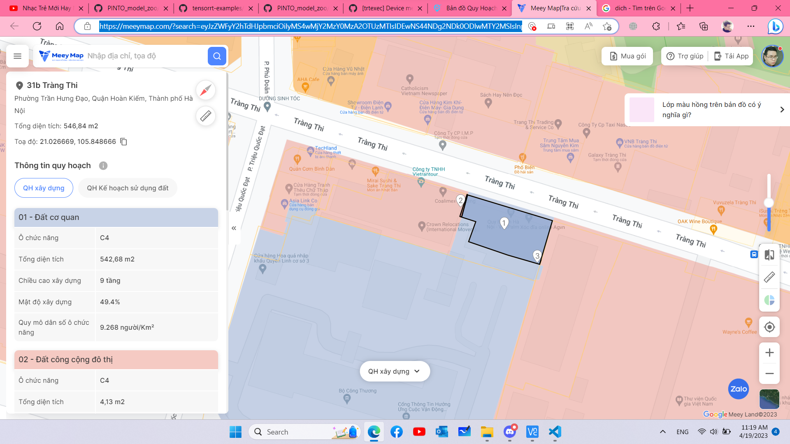

# Tìm hiểu về bản đồ địa chính

## Các khái niệm cơ bản
### 1. Bản đồ địa chính là gì?
- Bản đồ địa chính là bản đồ thể hiện các thửa đất và các yếu tố địa lý có liên quan, lập theo đơn vị hành chính xã, phường, thị trấn, được cơ quan nhà nước có thẩm quyền xác nhận
-  Bản đồ địa chính được lập theo các tỉ lệ: 1:200, 1:500, 1:1000, 1:2000, 1:5000,1:10000
- Bản đồ địa chính được thể hiện qua các nội dung sau:
    + Thống kê, kiểm kê đất đai theo từng đơn vị hành chính xã, phường, thị trấn
    + Xác lập, ghi nhận thông tin quyền sử dụng đất đối với từng thửa đất
    + Là căn cứ giúp cơ quan nhà nước có thẩm quyền thực thi các nội dung quản lý đất đai hoặc nội dung có liên quan
    + Cung cấp thông tin và là cơ sở pháp lý cho các hoạt động có liên quan đến đất đai

### 2. Nội dung bản đồ địa chính
Bao gồm:
- Khung bản đồ
- Điểm không chế tọa độ, điểm địa chính
- Mốc địa giới hành chính, đường địa giới hành chính các cấp
- Mốc giới quy hoạch
- Ranh giới thửa đất, loại đất, số thứ tự và diện tích thửa đất
- Nhà ở và các công trình xây dựng
- Đường giao thông, công trình thủy lợi
- Địa vật
- Dáng đất
- Ghi chú thuyết minh

### 3. Trích lục bản đồ địa chính
- Là hình thức cung cấp, xác thực thông tin thửa đất với các nội dung như:
    - Số thứ tự thửa đất, tờ bản đồ số
    - Diện tích (mét vuông)
    - Mục đích sử dụng đất
    - Tên người sử dụng đất và địa chỉ thường trú
    - Các thay đổi của thửa đất so với giấy tờ pháp lý về quyền sử dụng đất
    - Bản vẽ thửa đất: Sơ đồ thửa và chiều dài cạnh thửa

### 4. Quy định về hệ thống thông tin đất đai
- Căn cứ vào **Thông tư 34/2014/TT-BTNMT**
- Nguyên tắc xây dựng hệ thống thông tin đất đai  

- Mô hình hệ thống: 
    + Là một phần của hệ thống thông tin tài nguyên và môi trường:
    + Được xây dựng theo hình cây: thu thập, đo đạc từ cấp xã, rồi gộp thành huyện, tỉnh, thành phố
    + Chỉ được truy cập nội bộ:  
    
- Các hình thức khai thác thông tin đất đai:
    + Khai thác dữ liệu trên cổng thông tin đất đai, internet, tin nhắn SMS
    + Nộp phiếu yêu cầu  

- Quy trình nộp phiếu yêu cầu: (Trích lục bản đồ địa chính)
    + Bước 1: Nộp phiếu yêu cầu tại Văn Phòng đăng ký đất đai hoặc UBND cấp xã  
    
    + Bước 2: Tiếp nhận và giải quyết
        + Cung cấp trích lục bản đồ
        + Thông báo nghĩa vụ tài chính
        + Nếu từ chối cần có văn bản từ chối
    + Bước 3: Trả kết quả  

- Phí và chi phí phải trả  

**Ghi chú:**
- Những cách khai thác thông tin trên chỉ phù hợp với việc khai thác thông tin cá nhân
- Đối với việc khai thác quy mô lớn, có một phương pháp khác đó là yêu cầu cung cấp qua hợp đồng:  

- Quy định về việc khai thác dữ liệu bằng hợp đồng: Cơ quan cung cấp dữ liệu Trung ương là Trung tâm dữ liệu và Thông tin đất đai, cấp địa phương là Văn phòng đăng ký đất đai  

## Các bản đồ địa chính sẵn có
### 1. MeeyMap
- Trang web: https://meeymap.com/
- Giá thành:
    + Miễn phí về tọa độ, diện tích
    + Mất phí cho các thông tin khác
- Có các thông tin về:
    + Diện tích, tọa độ
    + Quy hoạch kế hoạch sử dụng: Tên đồ án, mục đích sử dụng đất
    
    + Quy hoạch xây dựng: Địa chỉ, các loại đất, chức năng, diện tích, mật độ xây dựng và mật độ dân cư của từng loại trong mẫu đất
    
- Ví dụ: [MeeyMap](https://meeymap.com/?search=eyJzZWFyY2hTdHJpbmciOiIyMS4wMjY2MzY0MzA2OTUzMTIsIDEwNS44NDg2NDk0ODIwMTY2MSIsInpvbmluZ1R5cGUiOjIsInNlYXJjaFR5cGUiOjN9)

### 2. Guland
- Trang web: https://guland.vn/soi-quy-hoach
- Xem và tra cứu miễn phí
- Thông tin:
    - Có thông tin về số thửa, mục đích sử dụng của từng mẫu đất
    
    - Overlay được bản đồ quy hoạch lên bản đồ thật
    
    - Có bản đồ bán nhà, có thể lọc và tìm kiếm theo giá
    
    - Xem được kích thước chi tiết của từng miếng đất
    
    - Người dùng có thể tìm miếng đất bằng số tờ số thửa
    

### 3. Dandautu
- Trang web: https://dandautu.vn/quy-hoach/tong-hop-ban-do-quy-hoach-ha-noi
- Trang web chỉ có bản đồ quy hoạch mục đích sử dụng
