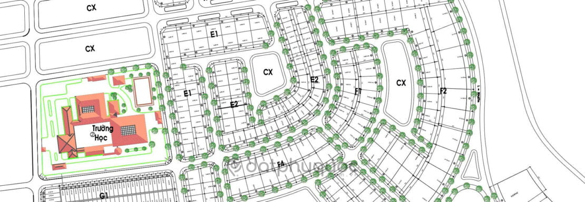
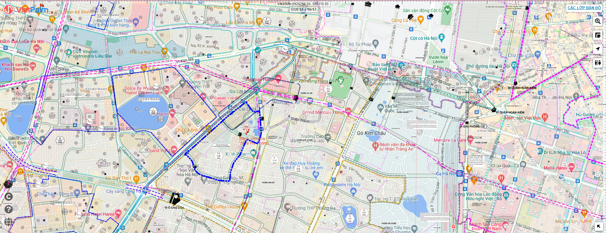

# Tìm hiểu về bản đồ quy hoạch

## Kiến thức cơ bản
### 1. Về bản đồ quy hoạch
- Là việc phân bổ lại không gian cho các hoạt động kinh tế – xã hội và quốc phòng – an ninh.
- Là một trong những tài liệu bắt buộc của đồ án quy hoạch.
- Bản đồ quy hoạch là bản đồ được lập tại thời điểm đầu kỳ quy hoạch, thể hiện sự phân bổ các loại đất tại thời điểm cuối kỳ của quy hoạch đó
- Được các cơ quan quản lý công khai, minh bạch và rất dễ tra cứu

### 2. Các loại bản đồ quy hoạch
Có 3 loại bản đồ quy hoạch được sử dụng phổ biến nhất:
- Bản đồ quy hoạch chung
- Bản đồ quy hoạch phân khu
- Bản đồ quy hoạch chi tiết xây dựng

#### a. Bản đồ quy hoạch chung
- Tỷ lệ 1/5000 hoặc 1/10000 với thị trấn, 1/10000 hoặc 1/25000 với thị xã, thành phố và 1/25000 hoặc 1/50000 với thành phố trực thuộc trung ương
- Giúp xác định:
    + Mốc giới
    + Các tuyến đường giao thông
    + Cơ sở hạ tầng cầu đường
    + Cây xanh, trường học, hồ nước, ...
- Để kêu gọi các nhà đầu tư tiềm năng, giải quyết các vấn đề đền bù và giải phóng mặt bằng

#### b. Bản đồ quy hoạch phân khu
- Tỷ lệ 1/2000
- Giúp xác định:
    + Chức năng sử dụng đất từng khu vực
    + Chi tiết hơn về cơ sở hạ tầng như:
        + Phạm vi ranh giới
        + Tính chất khu vực lập quy hoạch
        + Diện tích
        + Chỉ tiêu dự kiến về CSHT, xã hội, dân cư
- Là cơ sở để giải quyết các vụ kiện tụng sau này

#### c. Bản đồ quy hoạch chi tiết xây dựng
- Tỷ lệ 1/500
- Chứa thông tin chi tiết tất cả các công trình trên đất, từ hạ tầng kỹ thuật, việc bố trí từng ranh giới lô đất
- Là quy hoạch tổng thể cho các dự án đầu tư xây dựng
- Có thể xác định vị trí công trình, thiết kế cơ sở, kỹ thuật xây dựng và thi công xây dựng

## Bản đồ quy hoạch Hà Nội
- VietPalm
- Trang web: https://quyhoach.hanoi.vn/
- Bản đồ quy hoạch chính thống và công khai của Hà Nội, có đầy đủ cả 3 loại bản đồ quy hoạch nêu trên.

## Nguồn dữ liệu
- Bản đồ quy hoạch cũ Hà Nội ([CAD file](https://www.fshare.vn/file/775THPQB5GLE/?token=1682049443))
- 300 file cad bản đồ Hà Nội và TP HCM
    + Hà Nội: [link](https://canhquan.net/thu-vien/phan-mem/pm014)
    + TP HCM: [link](https://canhquan.net/thu-vien/phan-mem/pm013)
- File bản đồ quy hoạch toàn quốc ([link](https://datnenvietnam.com/file-ban-do-quy-hoach-63-tinh-pdf-cad-mien-phi/))
- Dữ liệu chính thống (PDF):
    + https://vanban.hanoi.gov.vn/quy-hoach-xay-dung-do-thi
    + http://quyhoach.xaydung.gov.vn/vn/Pages/Trangchu.aspx